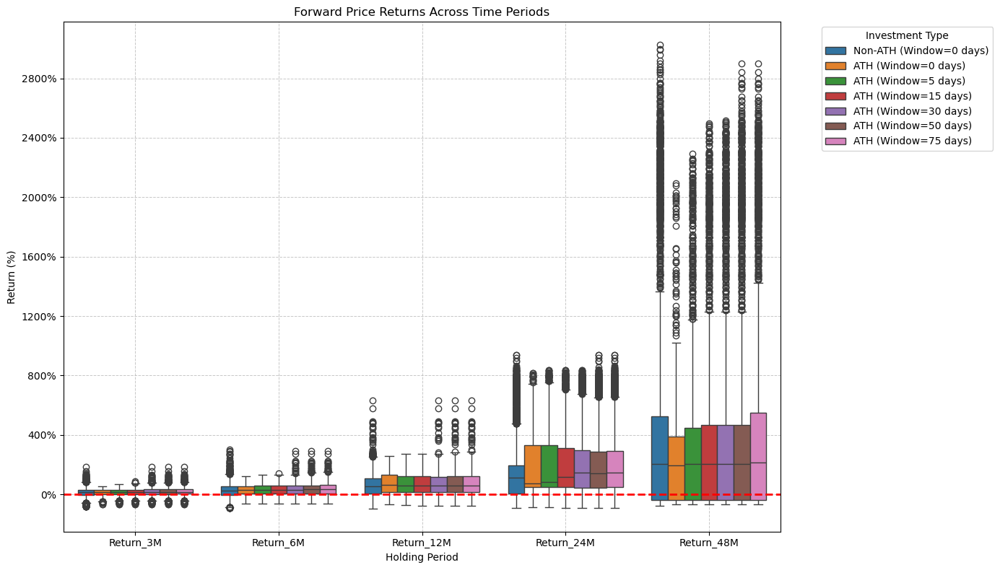
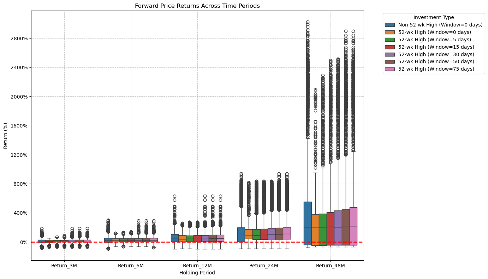

# Investing at All-Time Highs (ATH) 📊

**J.P. Morgan Asset Management** reports that buying at ATHs in popular ETFs like the **S&P 500** has minimal impact on long-term performance. In fact, history shows investors can benefit from investing at ATHs rather than waiting for a dip.

More details can be found [here](https://www.jpmorgan.com/insights/markets/top-market-takeaways/3-considerations-for-investing-in-a-bull-market#:~:text=Over%2024%20months%2C%20an%20individual,return%20an%20average%20of%2018.5%25).
  

# How Does Investing in Leveraged ETFs at or near All-Time Highs or 52 Week Highs Compare?
This repository aims to provide a reproducible answer to that question. By simulating historical leveraged data and backtesting return rates, it seeks to analyze the risks and rewards of investing in leveraged portfolios during market highs in a reproducible manner.  

| File                             | What it does                                                                                                                |
|----------------------------------|-----------------------------------------------------------------------------------------------------------------------------|
| `Demo-Single-Stock.ipynb`        | Simulates and backtests the return rates of a **single stock** selected by the user.                                        |
| `Demo-Portfolio.ipynb`           | Simulates and backtests the return rates of a **porfolio of stocks** selected by the user.                                  |
| `utilities.ipynb`                | Provides callable functions for data preprocessing, return calculations, and plotting.                                      |
  
## **Leveraged Single Stock Returns**
### 3X Leveraging $SPY ($UPRO)
| When Buying On or Near an All-Time High                 | When Buying On or Near a 52-Week High                 |
|---------------------------------------------------------|-----------------------------------------------------------|
|  |  |
### When Buying On or Near a 52-Week High

## **Leveraged Portfolio of Stock Returns**
### When Buying On or Near an All-Time High
### When Buying On or Near a 52-Week High

# Key Findings

