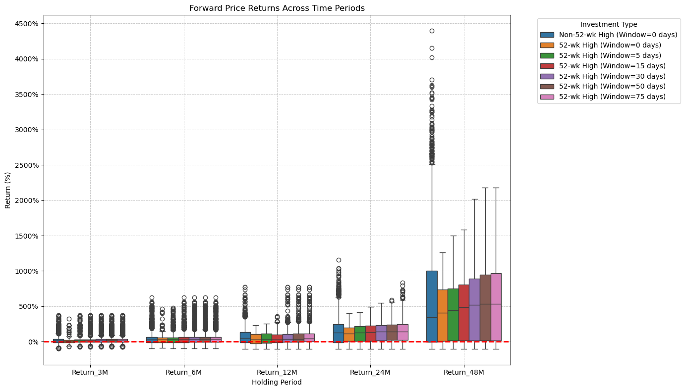

# Investing at All-Time Highs (ATH) 📊

**J.P. Morgan Asset Management** reports that buying at ATHs in popular ETFs like the **S&P 500** has minimal impact on long-term performance. In fact, history shows investors can benefit from investing at ATHs rather than waiting for a dip.

More details can be found [here](https://www.jpmorgan.com/insights/markets/top-market-takeaways/3-considerations-for-investing-in-a-bull-market#:~:text=Over%2024%20months%2C%20an%20individual,return%20an%20average%20of%2018.5%25).
  

# How Does Investing in Leveraged ETFs at or near All-Time Highs or 52 Week Highs Compare?
This repository aims to provide a reproducible answer to that question. By simulating historical leveraged data and backtesting return rates, it seeks to analyze the risks and rewards of investing in leveraged portfolios during market highs in a reproducible manner.  

| File                             | What it does                                                                                                                |
|----------------------------------|-----------------------------------------------------------------------------------------------------------------------------|
| `Demo-Single-Stock.ipynb`        | Simulates and backtests the return rates of a **single stock** selected by the user.                                        |
| `Demo-Portfolio.ipynb`           | Simulates and backtests the return rates of a **porfolio of stocks** selected by the user.                                  |
| `utilities.ipynb`                | Provides callable functions for data preprocessing, return calculations, and plotting.                                      |

$~$
  
## **Leveraged Single Stock Returns**
### Applying a 3x leverage multiplier to the daily returns of $SPY, equivalent to $UPRO.
| When Buying On or Near an All-Time High                 | When Buying On or Near a 52-Week High                 |
|---------------------------------------------------------|-----------------------------------------------------------|
|  |  |

### Similarly to above we can apply a 2x leverage multiplier to the daily returns of $SPY, equivalent to $SPUU.
| When Buying On or Near an All-Time High                 | When Buying On or Near a 52-Week High                 |
|---------------------------------------------------------|-----------------------------------------------------------|
|  |  |

### If we’re concerned that the simulated timeframe isn’t representative, we could use [Shiller Data](http://www.econ.yale.edu/~shiller/data.htm), which includes historical returns for large-cap U.S. stocks such as the S&P 500, dating back to the 1800s. This would help us better understand how leveraging the S&P 500 performs across various market conditions. The following plots are 3X leveraged.
| When Buying On or Near an All-Time High                 | When Buying On or Near a 52-Week High                 |
|---------------------------------------------------------|-----------------------------------------------------------|
|  |  |
  
$~$

## **Leveraged Portfolio of Stock Returns**
### Applying a 3x leverage multiplier to the daily returns of $QQQ, $SPY, and $SOXX (equivalent to $TQQQ, $UPRO, and $SOXL), with $TQQQ representing 60% of the portfolio, $UPRO 20%, and $SOXL 20%.
| When Buying On or Near an All-Time High                 | When Buying On or Near a 52-Week High                 |
|---------------------------------------------------------|-----------------------------------------------------------|
|  |  |

# Key Findings
⭐ Backtesting with leveraged Shiller data from the 1800s shows that investing at all-time or 52-week highs underperforms the baseline index. However, after about 4 years, the value gap between the baseline and leveraged investments closes.

⭐ Leveraging a portfolio of stocks outperforms and reduces risk compared to leveraging a single stock.

⭐ Investing at an all-time high in portfolio price carries more momentum than investing at a 52-week high.  

